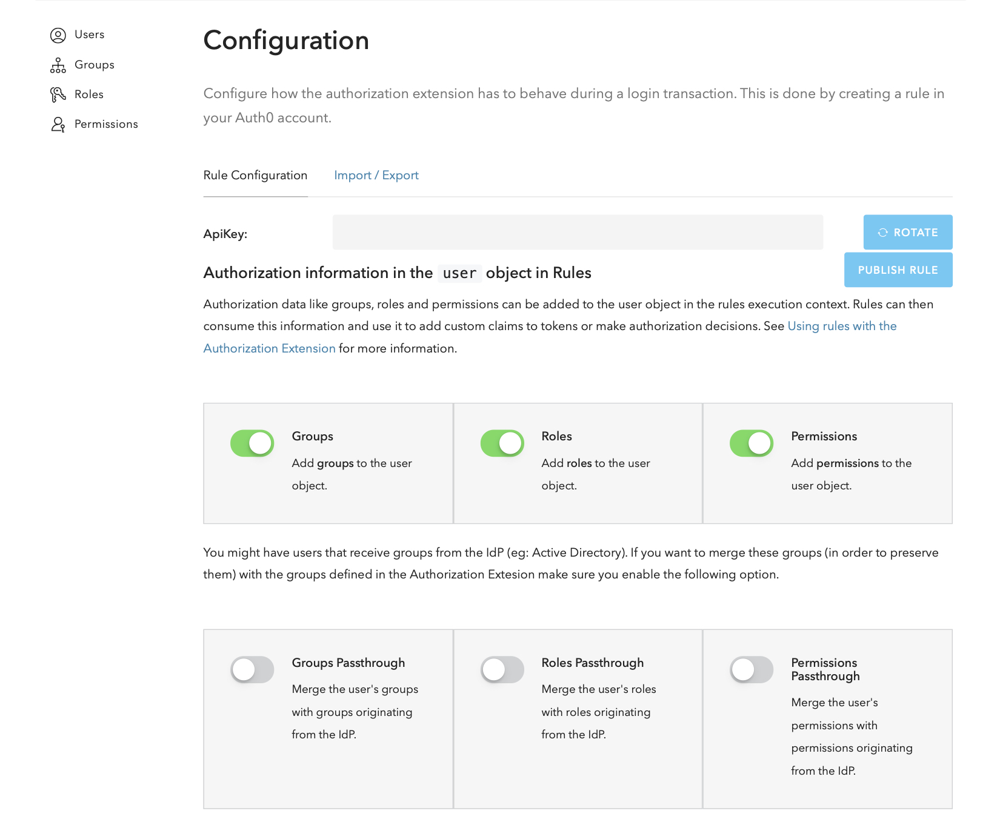
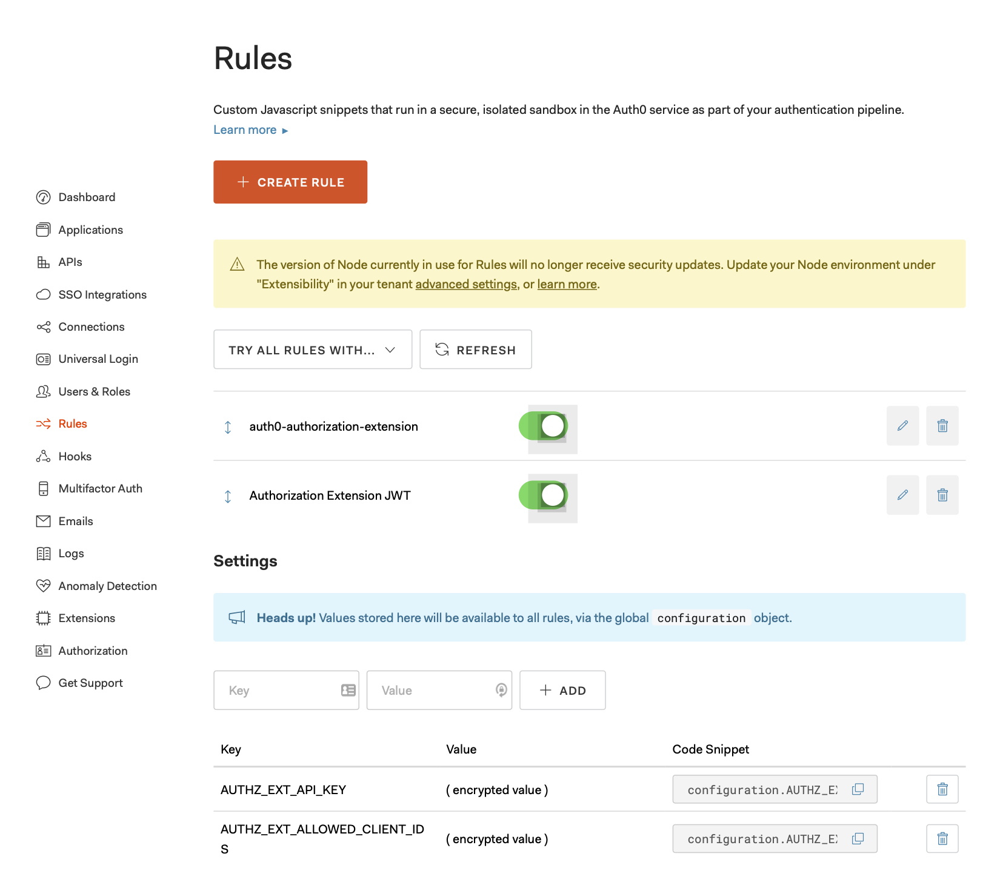
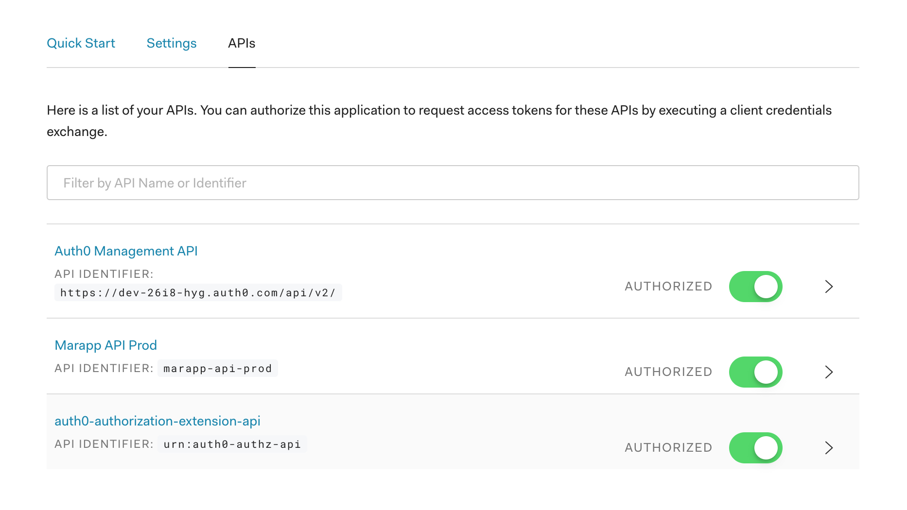

# Auth0 

## Create Auth0 application

Create a Single Page Web Application. The following need to be configured accordingly to the domain name of the deployed instance.

- Application Login URI
- Allowed Callback URLs
- Allowed Logout URLs
- Allowed Web Origins
- Allowed Origins (CORS)

For more details about supporting a Single Page Application (SPA) in Auth0, see: https://auth0.com/docs/dashboard/guides/applications/register-app-spa

Create a new API application, give it a name and unique identifier, and select `RS256` for the signing algorithm. This will be used to validate the Access Token by the consumer services.

For more detail about access tokens, see: https://auth0.com/docs/tokens/concepts/access-tokens

## Authorization Extension

Using Authorization Extension, we can store authorization data like groups, roles, or permissions in the outgoing token issued by Auth0. The application can then consume this information by inspecting the token and take appropriate actions based on the authorization context of the user.

For more details about enabling the Authorization Extension, see: https://auth0.com/docs/extensions/authorization-extension/v2

The following settings are required to forward the authorization context to the rules execution context.



Enable API Access to the Authorization Extension, for details, see: https://auth0.com/docs/extensions/authorization-extension/v2/api-access

## Rules

By default, the Authorization Extension creates and enables a rule called `auth0-authorization-extension`.

In addition to the default rule, we need to create a new one which allows us to store the authorization data (groups, roles, and permissions) in the outgoing token.

Create a new rule called `Authorization Extension JWT` and copy the following code snippet. 

```javascript
/**
 * Rules are code snippets written in JavaScript that are executed as part of the authentication
 * pipeline in Auth0. This happens every time a user authenticates to an application.
 * See: https://auth0.com/docs/rules
 *
 * Add role-based access control claims in the JWT bearer token.
 *
 * Requires the following variable stored via the global configuration object:
 *  AUTHZ_EXT_ALLOWED_CLIENT_IDS = <CLIENT-ID1>,<CLIENT-ID2>,...
 */
function A(user, context, callback) {
  const CLIENT_ID = context.clientID;
  const AUTHZ_EXT_ALLOWED_CLIENT_IDS = configuration.AUTHZ_EXT_ALLOWED_CLIENT_IDS;

  const ALLOWED_CLIENT_IDS = AUTHZ_EXT_ALLOWED_CLIENT_IDS ? AUTHZ_EXT_ALLOWED_CLIENT_IDS.split(',') : [];

  // Exclude clients not registered via the global config object;
  if (!ALLOWED_CLIENT_IDS.includes(CLIENT_ID)) {
    return callback(null, user, context);
  }

  // Auth0 will enforce namespacing when performing OIDC-conformant
  // login flows, meaning that any custom claims without HTTP/HTTPS
  // namespaces will be silently excluded from tokens.
  const namespace = 'https://marapp.org/';

  context.idToken[namespace + 'permissions'] = user.permissions;
  context.idToken[namespace + 'groups'] = user.groups;
  context.idToken[namespace + 'roles'] = user.roles;

  context.accessToken[namespace + 'permissions'] = user.permissions;
  context.accessToken[namespace + 'groups'] = user.groups;
  context.accessToken[namespace + 'roles'] = user.roles;

  callback(null, user, context);
}
```

Add a new setting key called `AUTHZ_EXT_ALLOWED_CLIENT_IDS` and add the client ID of the SPA application created in the previous step. This will forward the authorization data in the outgoing token only for the selected applications.



Note: The rule order is important, make sure the rule you add is after the `auth0-authorization-extension`.

## Create and Authorize a Machine-to-Machine Application

Create a new Machine-to-Machine Application, this will be used to remotely manage the authorization data (groups, roles, and permissions) and access the Auth0 Management API.

You will need to authorize the Machine-to-Machine Application for the following APIs and permissions (scopes):
- Auth0 Management API (scopes: `read:users`, `update:users`, `delete:users`, `create:users`)
- auth0-authorization-extension-api (scopes: all scopes)
- \<YOUR-API-CONSUMER> (created in a previous step)


