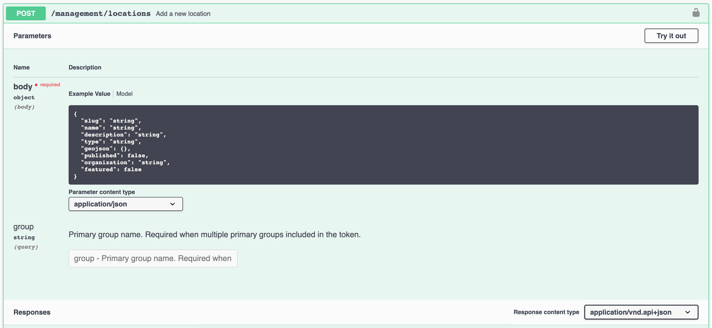
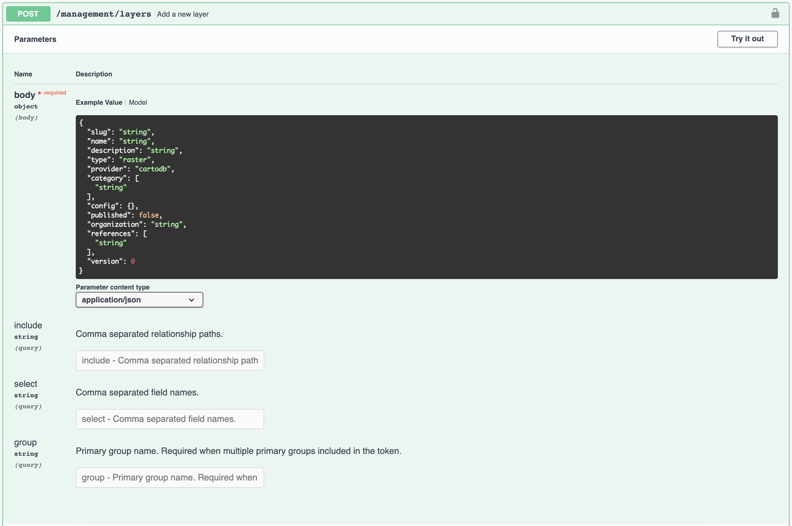

# Data management

Swagger documentation available at: `/services/api/v1/docs/`

Management endpoints are available for all data model types.
- locations
- collections
- metrics
- layers
- widgets
- dashboards

## Adding Location data

- endpoint: `/services/api/v1/docs/#/locations-management/addLocation`



### Required format

```
{
    id: string              (optional UUIDV4, auto-generated)
    slug: string            (required, unique)
    name: string            (required)
    description: string     (optional)
    type: string            (required, choices: Continent|Country|Jurisdiction|Biome|Protected Area|Species Area)
    geojson: object         (required, see: https://tools.ietf.org/html/rfc7946)
    published: boolean      (required)
    featured: boolean       (required)
}
```

Sample request:
```
curl -X POST '<HOSTNAME>/services/api/v1/management/locations?group=<GROUP>' \
  -H 'authorization: Bearer <TOKEN>' \
  -H 'content-type: application/json;charset=UTF-8' \
  --data-binary '{"slug":"springfield","name":"Springfield","description":"Springfield (The Simpsons)","type":"Jurisdiction","featured":true,"published":true,"geojson":{"type":"FeatureCollection","features":[{"type":"Feature","properties":{},"geometry":{"type":"Polygon","coordinates":[[[-484.02465820312494,42.04113400940807],[-477.015380859375,42.04113400940807],[-477.015380859375,45.537136680398596],[-484.02465820312494,45.537136680398596],[-484.02465820312494,42.04113400940807]]]}}]}}' \
  --compressed
```
- HOSTNAME: API hostname.
- TOKEN: Bearer token
- GROUP: Workspace to assign the content.
- TYPE: Asset type (location, layer). If not provided, defaults to location.

Note: `ApiKey` authorization can be used instead of the Bearer token via `-H 'apiKey: <APIKEY>`

### Uploading content via local script

Required format
- same as above, but in JSONL format (see: http://jsonlines.org)
```
$ cat example.jsonl | ./support/bootstrap-fixture-data.ts --apiKey <APIKEY> --organization <GROUP> --type <TYPE>
```

# Adding Layer data

- endpoint: `/services/api/v1/docs/#/layers-management/addLayer`



### Required format

```
{
    id: string              (optional UUIDV4, auto-generated)
    name: string            (required)
    slug: string            (optional, auto-generated from name)
    description: string     (optional)
    primary: boolean        (optional, defaults to false)
    published: boolean      (optional, defaults to false)
    type: string            (required, choices: raster|vector|geojson|group|video)
    provider: string        (required, choices: cartodb|gee|mapbox|leaflet)
    category: string[]      (required, choices: Biodiversity|Climate & Carbon|Ecosystem Services|Human Impact|Land Cover|Marine|Natural Hazards|Protected Areas|Restoration|Socio-Economic)
    config: object          (required)
    references: string[]    (optional, child layer references)
}
```

Sample request:
```
curl -X POST '<HOSTNAME>/services/api/v1/management/layers?group=<GROUP>' \
  -H 'authorization: Bearer <TOKEN>' \
  -H 'content-type: application/json;charset=UTF-8' \
  --data-binary '{"id":"0d716cf9-e614-46da-9c10-fa7e7da4b425","name":"Biodiversity Intactness 2015","slug":"biodiversity-intactness","primary":true,"published":true,"type":"raster","category":"Biodiversity","provider":"gee","config":{"source":{"type":"raster","assetId":"<ASSET_ID>","sldValue":"<RasterSymbolizer> <ColorMap type=\"ramp\" extended=\"false\"> <ColorMapEntry color=\"#efffd1\" quantity=\"0.0\" opacity=\"1\" /> <ColorMapEntry color=\"#235c1a\" quantity=\"1.0\" /> </ColorMap> </RasterSymbolizer>","styleType":"sld","tiles":["https://<API-HOST>/services/api/v1/tiles/0d716cf9-e614-46da-9c10-fa7e7da4b425/{z}/{x}/{y}"]},"legendConfig":{"items":[{"color":"#efffd1","value":"0"},{"color":"#235c1a","value":"100"}],"type":"gradient"},"interactionConfig":{"type":"","config":{"url":""},"output":[{"column":"","property":"","type":"","format":""}]},"applicationConfig":{},"staticImageConfig":{}}}' \
  --compressed
```
- HOSTNAME: API hostname.
- TOKEN: Bearer token
- GROUP: Workspace to assign the content.

Note: `ApiKey` authorization can be used instead of the Bearer token via `-H 'apiKey: <APIKEY>`

### Uploading content via local script

Required format
- same as above, but in JSONL format (see: http://jsonlines.org)
```
TODO:
```
