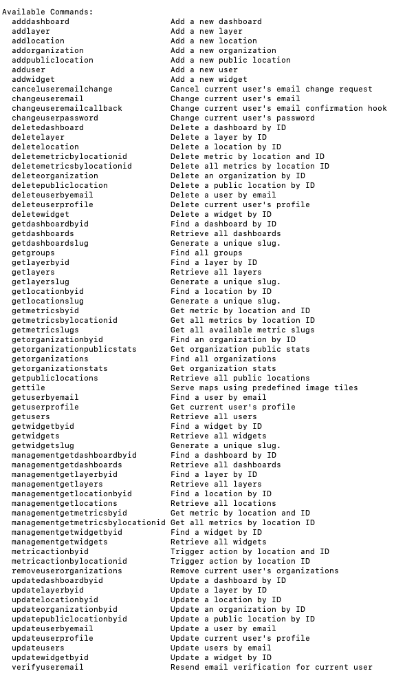

# CLI

There are tools that help you use a CLI based on the OpenAPI Specification.\
The API defines the spec file [here](src/spec/swagger.yaml).

We'll use [Restish](https://rest.sh/#/) in this example, but please feel free to choose your preferred one.

## Instalation

NOTE: If you find difficulties installing or using the tool, please refer to the official documentation [here](https://rest.sh/#/guide?id=guide).

In order to install [Restish](https://rest.sh/#/), you'll need to use one of the methods listed below:

using [Homebrew](https://brew.sh/):
```
$ brew tap danielgtaylor/restish
$ brew install restish
```

using [Go](https://golang.org/):
```
go get -u github.com/danielgtaylor/restish
```

To confirm the installation:
```
$ restish --version
```

## Configuration

Please use the following JSON config:

```
{
  "marapp": {
    "base": "<API_URL>",
    "profiles": {
      "token": {
        "auth": {
          "name": "oauth-authorization-code",
          "params": {
            "audience": "<AUTH0_AUDIENCE>",
            "authorize_url": "<AUTH0_DOMAIN>/authorize",
            "client_id": "<AUTH0_CLIENT_ID>",
            "scopes": "openid profile email offline_access",
            "token_url": "<AUTH0_DOMAIN>/oauth/token"
          }
        }
      }
    },
    "spec_files": [
      "./spec.yaml"
    ]
  }
}
```
NOTE: Please replace every `<VARIABLE>` (e.g. `<API_URL>`, `<AUTH0_AUDIENCE>`) with the actual value.

Save it to `config.json`, then:
```
$ cp config.json ~/.restish/apis.json
```

## Spec file
Download the spec file and place it in `~/.restish/spec.yaml`.
```
$ curl https://github.com/natgeosociety/marapp-services/blob/master/src/spec/swagger.yaml > ~/.restish/spec.yaml
```

NOTE: Please make sure to run this command every time when a new marapp version is available.

## Usage Example
Get the available commands using:
```
restish marapp --help
```



Non auth to retrieve `locations`:
```
restish marapp getpubliclocations
```

Auth command to get `profile`.
\
NOTE: You'll be prompted to enter login credentials on the login page.
```
restish marapp getuserprofile -p token
```

