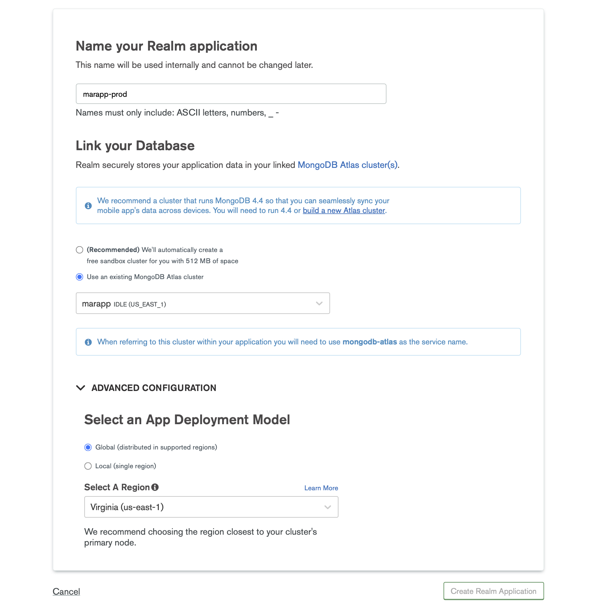
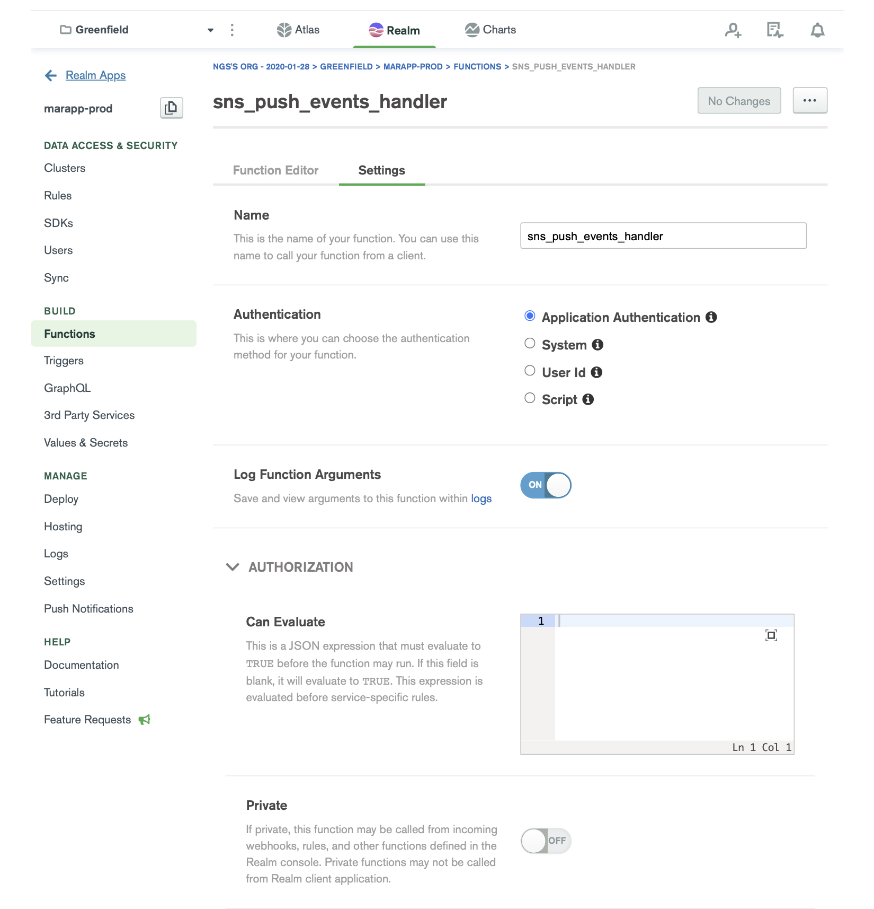
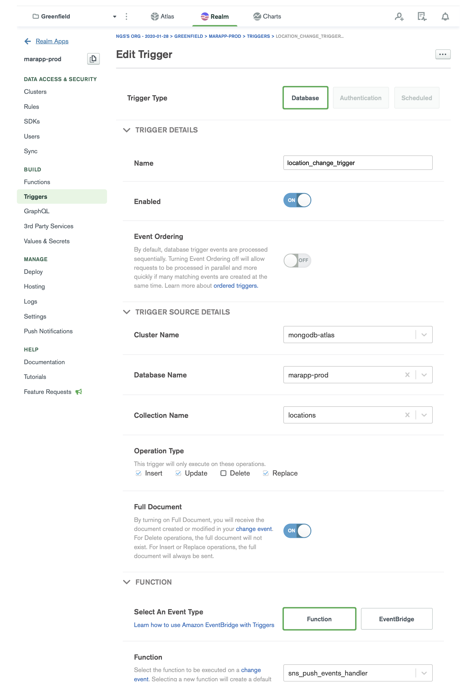

# MongoDB Atlas

Integration requires a MongoDB Realm application to be created, which will use a database trigger and function to forward change events to Amazon SNS topics for system-to-system messaging.

## Create a Realm Application

You will need to create a MongoDB Atlas Realm Application linked to your Atlas Cluster.

For more information about creating and linking a Realm Application, see: https://docs.mongodb.com/realm/procedures/create-realm-app/



## Creating a 3rd Party Service

You will need to create a 3rd Party Service inside the created Realm Application.

Select AWS, Access AWS services from the service types, and fill in the AWS Access Key ID & Secret Access Key pair.

Note: The AWS Access Key ID & Secret Access Key pair need to have push access to Amazon SNS. 


## Creating a trigger function

A function needs to be created which will allow sending events using the 3rd Party Service created in the previous step.



In the function editor section add the following snippet which will allow `insert`, `update`, `replace` events to be sent via SNS for system-to-system messaging.
```javascript
const SNS_TOPIC_ARN = '<SNS_TOPIC_ARN>';
const STITCH_AWS_SERVICE = '<STITCH_AWS_SERVICE>';
const STITCH_AWS_SERVICE_REGION = '<STITCH_AWS_SERVICE_REGION>';

/**
 * Realm Functions allow you to define and execute server-side logic for your application.
 * For more details about Realm Functions, see: https://docs.mongodb.com/realm/functions/
 *
 * A Database Trigger will always call a function with a changeEvent.
 * Documentation on ChangeEvents: https://docs.mongodb.com/manual/reference/change-events/
 *
 * Requires the following configuration:
 *  SNS_TOPIC_ARN: AWS SNS topic ARN you want to publish to.
 *  STITCH_AWS_SERVICE: The name of the Stitch 3rd party AWS service.
 *  STITCH_AWS_SERVICE_REGION = The region of the Stitch 3rd party AWS service.
 *
 * @param changeEvent
 */
exports = function (changeEvent) {
  const SNS = context.services.get(STITCH_AWS_SERVICE).sns(STITCH_AWS_SERVICE_REGION);

  const docId = changeEvent['documentKey']['_id'];
  const operationType = changeEvent['operationType'];

  console.log(`Received event: ${operationType}`);

  if (['insert', 'update', 'replace'].indexOf(operationType) !== -1) {
    const doc = changeEvent['fullDocument'];
    const payload = { id: docId, eventType: operationType, version: doc.version };

    if (operationType === 'update') {
      const updatedFields = changeEvent['updateDescription']['updatedFields'];

      // In case of an update event, publish an event only if certain fields were changed;
      if (!('geojson' in updatedFields)) {
        console.log('No changes detected.');
        return;
      }
    }
    const params = {
      Message: JSON.stringify(payload),
      TopicArn: SNS_TOPIC_ARN,
    };
    return SNS.Publish(params)
      .then((data) => {
        console.log(`Successfully published SNS event ${data['MessageId']} for document: ${docId}`);
      })
      .catch((err) => {
        console.error(`Failed to trigger SNS event for document: ${docId}`, err);
      });
  }
};
```

The following variables need to be replaced:
- SNS_TOPIC_ARN: Amazon SNS Topic ARN where to push on-change events;
- STITCH_AWS_SERVICE: Name of the 3rd Party Service created in the previous step;
- STITCH_AWS_SERVICE_REGION: 3rd Party Service region;

## Creating a trigger

The final step is to create a trigger which will listen for events on a particular collection from the cluster.


 
After resources are created, the Realm application needs to be deployed in order for the changes to take effect.
 
